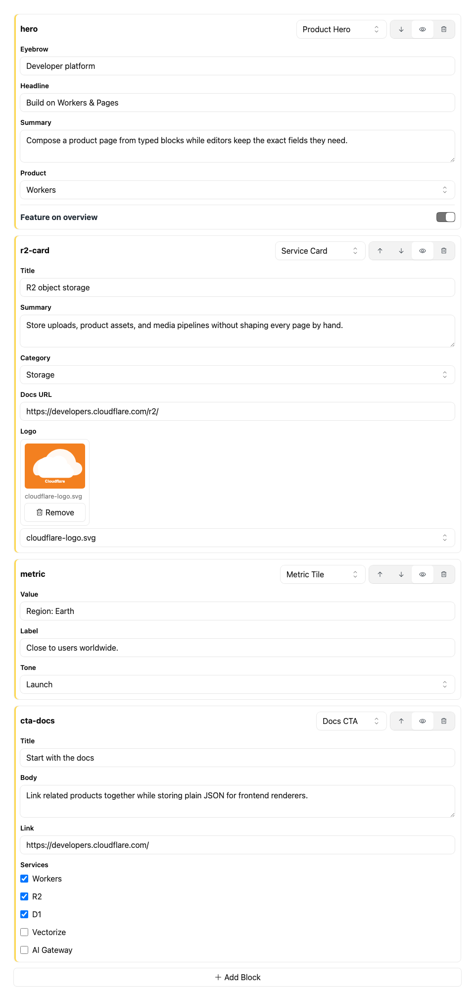

# @bnomei/emdash-blocks

[](https://www.npmjs.com/package/@bnomei/emdash-blocks)
[](https://www.npmjs.com/package/@bnomei/emdash-blocks)
[](https://www.npmjs.com/package/@bnomei/emdash-blocks)
[](./package.json)
[](https://github.com/bnomei/emdash-blocks)

Structured block-list editor for EmDash JSON fields.

`@bnomei/emdash-blocks` is a native EmDash plugin for ordered
content blocks stored as plain JSON. It registers the `block-builder:blocks`
admin widget, lets schemas define project-specific block types and typed prop
controls, and exports runtime helpers for Astro renderers. Use it when an
EmDash site needs controlled page sections, marketing modules, email blocks, or
imported block data without moving that content into Portable Text.

## What It Provides

- Native EmDash plugin factory: `blockBuilderPlugin()`.
- JSON field widget: `block-builder:blocks`.
- Stored value shape for ordered blocks with `id`, `type`, `hidden`, and
  `props`.
- Admin UI built with [Kumo UI](https://kumo-ui.com/) with full light and dark
  mode support.
- Frontend helpers: `visibleBlocks()`, `blockProps()`, and
  `isBlockBuilderBlock()`.

## Install

```sh
npm install @bnomei/emdash-blocks
```

Register the plugin in `astro.config.mjs`:

```js
import emdash from "emdash/astro";
import { blockBuilderPlugin } from "@bnomei/emdash-blocks";

export default {
  integrations: [
    emdash({
      plugins: [blockBuilderPlugin()],
    }),
  ],
};
```

## Field Widget

Use the widget on an EmDash `json` field:

```json
{
  "slug": "blocks",
  "label": "Blocks",
  "type": "json",
  "widget": "block-builder:blocks",
  "options": {
    "blockTypes": [
      { "type": "heading", "label": "Heading" },
      { "type": "text", "label": "Text" },
      { "type": "image", "label": "Image" }
    ]
  }
}
```

Use `blockDefinitions` when the editor should render typed prop controls instead
of the raw JSON fallback:

```json
{
  "slug": "blocks",
  "label": "Blocks",
  "type": "json",
  "widget": "block-builder:blocks",
  "options": {
    "blockDefinitions": [
      {
        "type": "heading",
        "label": "Heading",
        "props": [
          { "key": "text", "label": "Text", "type": "text" },
          {
            "key": "level",
            "label": "Level",
            "type": "select",
            "defaultValue": "h2",
            "options": ["h1", "h2", "h3", "h4"]
          }
        ]
      }
    ]
  }
}
```

Supported prop field types include all 16 EmDash field types: `string`, `text`,
`url`, `number`, `integer`, `boolean`, `datetime`, `select`, `multiSelect`,
`portableText`, `image`, `file`, `reference`, `json`, `slug`, and `repeater`.

The block builder also supports generic block-editor field types: `writer`,
`markdown`, `textarea`, `color`, `media`, and `media-list`. Text-like fields
render as text inputs or textareas, numeric fields normalize numeric values,
`boolean` renders as a switch, `select` and `multiSelect` render choice controls,
and `portableText`/`writer` render the built-in rich text editor with paragraph,
heading, quote, bold, italic, list, and link controls. `media` and `media-list`
render media-library selectors backed by EmDash media values. `json` and
`repeater` use focused JSON editors, with `repeater` stored as a JSON array until
a dedicated repeater UI is available. `image`, `file`, `reference`, and `slug`
render ID/text inputs that match EmDash's stored values for those field types.

Project-specific block types should be supplied through field options, or from a
site-local helper/plugin that writes those options. Keep the publishable block
builder package focused on generic block editing.

The package defaults include only generic starter blocks. Site-specific blocks
belong in `options.blockDefinitions` on each field schema.

## Stored Value

```ts
type BlockBuilderValue = Array<{
  id: string;
  type: string;
  hidden?: boolean;
  props: Record<string, unknown>;
}>;
```

## Frontend Rendering

The package exports helpers for frontend renderers:

```ts
import { blockProps, isBlockBuilderBlock, visibleBlocks } from "@bnomei/emdash-blocks";

const blocks = visibleBlocks(entry.blocks);
```

Renderers should use `block.type` to pick a component and `block.props` for that
component's data:

```astro
{
  blocks.map((block) => (
    <>
      {block.type === "heading" && <HeadingBlock props={blockProps(block)} />}
      {block.type === "text" && <TextBlock props={blockProps(block)} />}
    </>
  ))
}
```

`visibleBlocks()` accepts native Block Builder values and filters hidden blocks.
Migration from other systems should happen before values are saved into EmDash.

## Package Surface

- ESM entry: `@bnomei/emdash-blocks`.
- Admin entry: `@bnomei/emdash-blocks/admin`.
- Type declarations are included from `dist/`.
- Peer dependencies: `emdash` `>=0.17.0`, `react` `^18.0.0 || ^19.0.0`,
  `react-dom` `^18.0.0 || ^19.0.0`, `@cloudflare/kumo` `^2.5.0`, and `@phosphor-icons/react`
  `^2.1.10`.

## Status

This package ships as a native EmDash plugin because the editor is a trusted React admin field widget. Package exports point at `vp pack`-built `dist/` JavaScript and declarations.

## Related Packages

- `@bnomei/emdash-fields` provides smaller JSON-backed field widgets.
- `@bnomei/emdash-bento` provides row and column layout editing and
  reuses Block Builder for nested blocks.

## License

MIT.

## Screenshot


